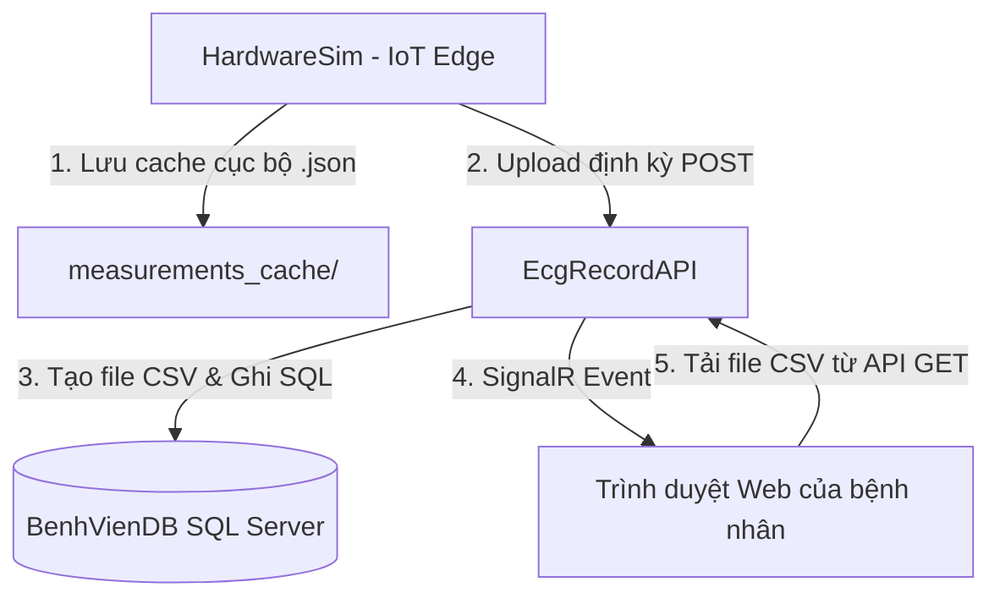

# IoT ECG Hardware Simulator (`HardwareSim`)

Mô-đun này giả lập một thiết bị y tế IoT đo điện tâm đồ (ECG) thực tế và truyền tải dữ liệu đo lường, bao gồm tín hiệu sóng, nhịp tim (Heart Rate - BPM) và độ biến thiên nhịp tim (RMSSD - ms) lên hệ thống backend.

---

## 📋 Mục lục
1. [Tổng quan hệ thống](#1-tổng-quan-hệ-thống)
2. [Các thay đổi đối với API Backend & Cơ sở dữ liệu](#2-các-thay-đổi-đối-với-api-backend--cơ-sở-dữ-liệu)
3. [Cơ chế lưu trữ và cache của Simulator](#3-cơ-chế-lưu-trữ-và-cache-của-simulator)
4. [Hướng dẫn cấu hình & Chạy thiết bị mô phỏng](#4-hướng-dẫn-cấu-hình--chạy-thiết-bị-mô-phỏng)
5. [Cập nhật hiển thị trên giao diện Web](#5-cập-nhật-hiển-thị-trên-giao-diện-web)
6. [Chuyển đổi thiết bị giữa các bệnh nhân](#6-chuyển-đổi-thiết-bị-giữa-các-bệnh-nhân)

---

## 1. Tổng quan hệ thống



Hệ thống bao gồm các thành phần:
*   **HardwareSim**: Chạy giả lập lấy tín hiệu thực tế từ tệp `data.csv`, tính toán nhịp tim ngẫu nhiên sinh động (60-90 bpm) và RMSSD (25-55 ms).
*   **EcgRecordAPI**: Cung cấp cổng tiếp nhận dữ liệu đo, lưu dữ liệu tín hiệu vào tệp CSV chuẩn hóa trên máy và lưu dữ liệu thông số vào SQL Server (`BenhVienDB`).
*   **Web App**: Lắng nghe sự kiện qua SignalR và cập nhật biểu đồ trực quan cùng các chỉ số sinh hiệu (BPM, RMSSD) trong thời gian thực mà không cần tải lại trang (F5).

---

## 2. Các thay đổi đối với API Backend & Cơ sở dữ liệu

Để hỗ trợ lưu trữ các trường dữ liệu sinh hiệu mới (`NhipTim` và `Rmssd`), chúng tôi đã thực hiện các thay đổi sau trong `EcgRecordAPI`:

### A. Khởi tạo Cơ sở dữ liệu (Startup Migration)
Khi API khởi chạy, nó tự động kiểm tra xem bảng `EcgRecords` trong SQL Server đã có hai cột `NhipTim` và `Rmssd` chưa. Nếu chưa có, các cột này sẽ được thêm tự động mà không làm mất mát dữ liệu hiện có:
```sql
ALTER TABLE [dbo].[EcgRecords] ADD [NhipTim] INT NULL;
ALTER TABLE [dbo].[EcgRecords] ADD [Rmssd] FLOAT NULL;
```

### B. Cập nhật Endpoint Upload dữ liệu (`/api/records/upload`)
*   Mở rộng đối tượng nhận dữ liệu `EcgUploadRequest` chứa thêm thuộc tính `NhipTim` và `Rmssd`.
*   Cập nhật câu lệnh SQL `INSERT` lưu trữ trực tiếp các giá trị này vào bản ghi của bệnh nhân tương ứng.

### C. Cập nhật Endpoint Danh sách bản ghi (`/api/records/{patientId}`)
*   Truy vấn lấy thêm `NhipTim` và `Rmssd` từ CSDL và đưa vào đối tượng JSON trả về web app dưới dạng các thuộc tính `nhipTim` và `rmssd`.

---

## 3. Cơ chế lưu trữ và cache của Simulator

Thiết bị mô phỏng hoạt động độc lập và có tính năng tự phục hồi khi mất kết nối mạng:
1.  **Bộ đo (Measurement Timer)**: Định kỳ chạy đo, đóng gói tín hiệu ECG thô cùng nhịp tim và RMSSD dưới dạng JSON và lưu vào thư mục `measurements_cache/` dưới dạng các tệp tin lưu trữ tạm thời (`ecg_yyyyMMdd_HHmmss_fff.json`).
2.  **Bộ gửi (Upload Timer)**: Định kỳ quét thư mục `measurements_cache/`, thực hiện upload tuần tự từng tệp tin lên API. Nếu gửi thành công, tệp cache sẽ bị xóa. Nếu mất mạng, tệp cache được giữ lại và sẽ tự động gửi bù khi mạng hoạt động trở lại.

---

## 4. Hướng dẫn cấu hình & Chạy thiết bị mô phỏng

### A. File cấu hình `config.json`
Simulator đọc cấu hình từ tệp tin `config.json` nằm trong thư mục gốc của dự án (hoặc thư mục đầu ra của build):
```json
{
  "MacAddress": "00:1A:2B:3C:4D:5E",
  "PatientId": 1,
  "MeasureIntervalSeconds": 30,
  "UploadIntervalSeconds": 60,
  "BaseApiUrl": "http://localhost:5000"
}
```
*   `MacAddress`: Địa chỉ vật lý đại diện của thiết bị IoT.
*   `PatientId`: ID của bệnh nhân được liên kết để lưu trữ.
*   `MeasureIntervalSeconds`: Tần suất thực hiện một lần đo và lưu vào cache (mặc định: `30` giây).
*   `UploadIntervalSeconds`: Tần suất quét cache và tải dữ liệu lên server (mặc định: `60` giây).

### B. Các bước khởi chạy
> [!IMPORTANT]
> Hãy chắc chắn rằng API Backend (`EcgRecordAPI`) đã được khởi chạy thành công trước khi bật Simulator để quá trình liên kết thiết bị diễn ra chuẩn xác.

1.  Mở Terminal tại thư mục `HardwareSim`:
    ```powershell
    cd HardwareSim
    ```
2.  Khởi chạy simulator bằng lệnh:
    ```powershell
    dotnet run
    ```
3.  Để tắt simulator một cách an toàn, gõ `exit` trong cửa sổ console của Simulator và nhấn `Enter`.

---

## 5. Cập nhật hiển thị trên giao diện Web

*   **HTML (`index.html`)**: Thêm cấu trúc hiển thị thông số `RMSSD` song song với `Heart rate` trong phần chi tiết bản ghi.
*   **CSS (`style.css`)**: Sử dụng lớp `.circle-outer2`, `.circle-inner2`, và `.bpm2` tạo vòng tròn đo lượng màu xanh ngọc lục bảo (Emerald) đặc trưng để phân biệt rõ ràng với biểu đồ nhịp tim.
*   **JS (`index.js`)**: Lấy các thông số thực tế từ DB thông qua API trả về và đưa vào hiển thị thay thế cho các chuỗi placeholder tĩnh:
    ```javascript
    elems.bpm.textContent = nhipTimVal ? `${nhipTimVal} bpm` : '60.3 bpm';
    elems.rmssd.textContent = rmssdVal ? `${Number(rmssdVal).toFixed(1)} ms` : '35.8 ms';
    ```

---

## 6. Chuyển đổi thiết bị giữa các bệnh nhân

Hệ thống hỗ trợ việc **bàn giao và tái gán thiết bị đo** cho các bệnh nhân khác một cách tự động và linh hoạt thông qua cấu hình `PatientId` trong simulator:

1. **Liên kết thiết bị mới**: Khi bạn thay đổi `PatientId` (ví dụ từ `1` sang `2`) trong `config.json` và khởi chạy Simulator, thiết bị sẽ gửi yêu cầu liên kết đến cổng `/api/devices/link`.
2. **Ghi nhận lịch sử liên kết**: API Server ghi nhận quan hệ sở hữu mới vào bảng lịch sử `PatientDevices` với thời gian kích hoạt kết nối hiện tại (`ConnectedAt`).
3. **Định tuyến dữ liệu đo đạc**: Khi các gói tin dữ liệu ECG được gửi lên thông qua địa chỉ vật lý `MacAddress` (`DeviceId`), backend sẽ truy vấn CSDL để tìm ID bệnh nhân được liên kết gần đây nhất:
   ```sql
   SELECT TOP 1 PatientId 
   FROM PatientDevices 
   WHERE DeviceId = @MacAddress 
   ORDER BY ConnectedAt DESC
   ```
   Do đó, toàn bộ các bản ghi đo mới sẽ được ghi nhận và lưu cho bệnh nhân mới (`PatientId: 2`) trong khi lịch sử đo đạc của bệnh nhân cũ (`PatientId: 1`) vẫn được bảo lưu nguyên vẹn trong hệ thống.
