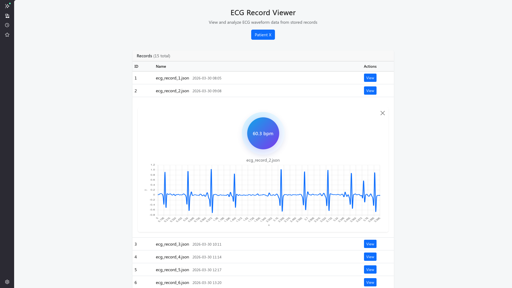

UI cơ bản cho btl KTPM

Task cần làm:
- Liên kết, tạo export đọc từ SQL bằng C# rồi parse nó vào csv. Module csv_module hiện đã mô phỏng đọc từ file csv rồi chiếu lên frontend bằng chart.js

Tham khảo thêm nếu cần:
https://www.youtube.com/watch?v=FRlqMJWlpTI

Code hiện tại có thể chạy bằng live-server / (vscode / visual studio)

